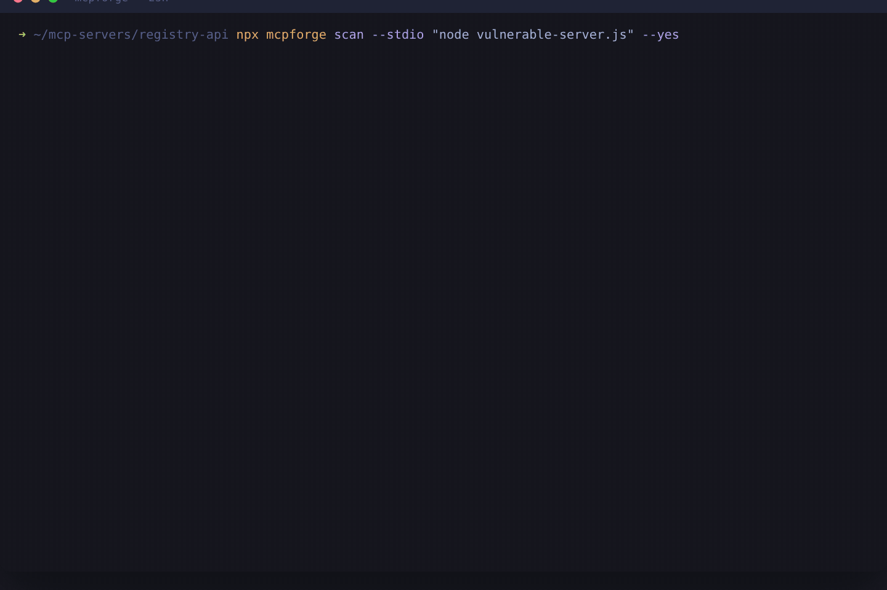

# MCPForge

**The deterministic security test suite for MCP servers.**

> Static scanners inspect what a server *advertises*. MCPForge proves what a
> server **does** — by sending real exploit payloads through live MCP tool
> calls and confirming exploitability from the responses.

[](https://github.com/Pratham2511/MCPForge/actions/workflows/ci.yml)
[](https://github.com/Pratham2511/MCPForge/actions/workflows/security.yml)
[](https://www.npmjs.com/package/mcpforge)
[](./LICENSE)



---

## Why MCPForge exists

The MCP ecosystem has a testing gap shaped exactly like this tool:

- **Snyk Agent Scan** (ex-mcp-scan/Invariant) reads tool descriptions and runs
  static natural-language analysis. It never sends an exploit. It cannot tell
  you whether the path-traversal it *suspects* is actually exploitable.
- **NVIDIA SkillSpector** statically scans agent *skill packages* — not live
  MCP servers — over 71 regex patterns.
- **Tencent AI-Infra-Guard** is a heavyweight red-team platform (Docker +
  server + fingerprinting) — great for a SOC, overkill for a repo's CI.
- The academic tooling ([MCP Safety Audit](https://arxiv.org/abs/2504.03767))
  is LLM-based: nondeterministic, slow, and not CI-gateable.

Meanwhile the 2025 CVE wave —
[CVE-2025-49596](https://nvd.nist.gov/vuln/detail/CVE-2025-49596) (MCP Inspector
RCE) and [CVE-2025-6514](https://nvd.nist.gov/vuln/detail/CVE-2025-6514)
(mcp-remote RCE) — made it painfully clear that MCP servers execute in
privileged, file-and-network-reachable contexts.

**MCPForge is the only CI-native tool that actively verifies MCP server
exploitability: deterministic payloads through real MCP sessions, SARIF for
GitHub Code Scanning, exit codes for PR gating, and an accuracy harness that
gates its own CI on 100% recall / 0 false positives.**

No LLM. No Docker. `npx mcpforge`.

## How it works

```
        ┌────────────────────────────────────────────────────────┐
        │                   CLI (commander)                      │
        └──────┬─────────────────────────────────────────────────┘
               │ load config (zod-validated)
               ▼
     ┌───────────────────┐      ┌─────────────────────────────┐
     │ TransportFactory  │─────▶│ Session (MCP client, SDK)   │
     │ stdio|http|sse    │      │ connect + initialize        │
     └───────────────────┘      └──────────┬──────────────────┘
                                           │ inventory()
                                           ▼
                              ┌─────────────────────────────┐
                              │ Inventory (paginated)       │
                              │ tools[] resources[] prompts │
                              └──────┬──────────┬───────────┘
                                     ▼          ▼
                          ┌────────────┐  ┌──────────────────────────┐
                          │ StaticPass │  │ ActivePass               │
                          │ descriptions│  │ ArgPlanner → Executor →  │
                          │ schemas     │  │ Analyzer (content signals)│
                          └──────┬─────┘  └──────────┬───────────────┘
                                 └────────┬──────────┘
                                          ▼
                          Report (terminal | json | SARIF 2.1.0)
                          + posture score + policy exit code
```

The **schema-aware argument planner** reads each tool's JSON Schema, classifies
every argument by intent (`path`, `url`, `command`, `sql`, `neutral`), places
the right payload family into the right argument, and fills all remaining
required arguments with benign typed values so calls are accepted by real
servers.

The **analyzer** only confirms a finding on *content signals* — a canary file's
contents, an executed echo-marker, a row-blast delta, a loopback admin banner —
never on payload reflection. Every signal is echo-safe: a server that merely
echoes its arguments can never produce a confirmed finding.

## The six checks

| Check | What it proves | Severity |
|---|---|---|
| `path-traversal` | Tool arguments / file resources escape the intended base directory and read arbitrary files (canary + `/etc/passwd` + `win.ini` confirmation) | high |
| `command-injection` | Shell metacharacters achieve real command execution (executed-marker confirmation, substitution + chain + newline vectors) | critical |
| `sql-injection` | Concatenated SQL: tautology row-blast (benign baseline vs attack) + per-engine error fingerprints (SQLite/Postgres/MySQL/Oracle/MSSQL) | critical |
| `ssrf` | Tools fetch internal targets: loopback services, `file://`, cloud metadata (marker-confirmed only) | critical |
| `credential-leak` | Secrets in descriptions/resources + active probes of `.env`, `/proc/self/environ`, `.ssh/id_rsa` with 13 secret pattern detectors (masked evidence) | critical |
| `prompt-injection` | Tool-poisoning: instructional override phrases and invisible/bidi unicode smuggled in metadata (arXiv:2504.03767 class) | medium |

All checks are deterministic (fixed payload packs, zero randomness, zero LLM)
and independently disableable.

## Quickstart

```bash
# stdio target — spawn and scan
npx mcpforge@latest scan --stdio "node dist/server.js" --yes

# HTTP target (streamable HTTP with automatic SSE fallback)
npx mcpforge@latest scan --url http://localhost:3000/mcp --yes

# inventory only — zero tool invocations, static pass only
npx mcpforge@latest scan --stdio "python -m my_mcp_server" --inventory-only

# CI: SARIF for GitHub Code Scanning + policy exit code
npx mcpforge@latest scan --stdio "node dist/server.js" \
  --format sarif -o mcpforge.sarif --fail-on high --yes
```

**Exit-code contract** (stable, CI-consumable):

| Code | Meaning |
|---|---|
| `0` | clean — no findings at/above `--fail-on` |
| `1` | policy failure — findings at/above threshold |
| `2` | scan failure — could not connect / scan crashed |
| `3` | usage error — bad flags, missing `--yes` consent |

> **Consent gate:** scanning executes the target and invokes its tools with
> attack payloads. `--yes` attests you understand this. Only scan servers you
> own or have written permission to test; sandbox untrusted targets.

## Use it as your CI security gate

In any repo that builds an MCP server:

```yaml
# .github/workflows/mcp-security.yml
name: MCP Security Gate
on:
  pull_request:
  push: { branches: [main] }

jobs:
  mcpforge:
    runs-on: ubuntu-latest
    permissions:
      security-events: write
      contents: read
    steps:
      - uses: actions/checkout@v4
      - uses: actions/setup-node@v4
        with: { node-version: 22 }
      - name: Build my MCP server
        run: npm ci && npm run build        # produces dist/server.js
      - name: MCPForge scan
        run: |
          npx mcpforge@latest scan \
            --stdio "node dist/server.js" \
            --format sarif -o mcpforge.sarif --yes
      - name: Upload results to Code Scanning
        uses: github/codeql-action/upload-sarif@v3
        with: { sarif_file: mcpforge.sarif }
```

- `--fail-on high` blocks PRs with high/critical findings; `--fail-on medium`
  is the paranoid setting; `--fail-on never` reports without gating.
- Every finding carries a stable **fingerprint** (`sha256(checkId|tool|payload|…)`),
  ready for baseline suppression files (v0.2 `--baseline`).
- SARIF is 2.1.0 with per-rule `security-severity` mapping — findings appear
  in GitHub's Security tab with severity and remediation guidance.

## The accuracy harness — the moat

`test/vulnerable-server/` is a deliberately vulnerable MCP server with **9
planted vulnerabilities** covering all six check classes, including tool
poisoning with invisible unicode (`\u200b`, `\u202e`) hidden in a tool
description. `test/safe-server/` is its hardened control group: the same
capability categories, correct defenses.

The e2e harness runs the **built CLI** against both and gates CI on:

1. **Recall = 100%** — all six checks fire on the vulnerable server, with
   confirmed evidence (canary content, executed markers, row-blast deltas,
   loopback banners).
2. **Precision = 100%** — zero confirmed findings on the hardened server
   (~200 live invocations, exit code 0).
3. **Determinism** — two consecutive scans produce identical fingerprint sets.

There is no "Juice Shop for MCP" anywhere else in the ecosystem. This pair is
both our quality gate and a public benchmark any other tool can be measured
against. Run it yourself:

```bash
npm run scan:vulnerable   # grade F, exit 1, 80+ findings
npm run scan:safe         # grade A, exit 0
npm run test:e2e          # the harness CI runs on Node 18/20/22
```

<details>
<summary>Sample report — vulnerable reference server</summary>

```
◆ MCPForge v0.1.0 — scan report
target: stdio: node_modules/.bin/tsx test/vulnerable-server/index.ts
inventory: 8 tools · 1 resources · 0 prompts

│ CRITICAL │ command-injection │ run_command   │ OS command injection confirmed (argument 'command')      │
│ CRITICAL │ sql-injection     │ search_users  │ SQL injection (tautology row-blast) confirmed             │
│ CRITICAL │ ssrf              │ fetch_url     │ SSRF confirmed (loopback admin reachable)                 │
│ CRITICAL │ credential-leak   │ read_notes    │ AWS Secret Access Key via probe '../.env' (masked)        │
│ HIGH     │ path-traversal    │ read_notes    │ Path traversal confirmed (canary content)                 │
│ MEDIUM   │ prompt-injection  │ dict_lookup   │ Invisible unicode in description (tool poisoning)         │

Posture score: 0/100 (grade F)   → exit 1
```
</details>

## Configuration

CLI flags override `mcpforge.config.json` (see
[mcpforge.config.example.json](mcpforge.config.example.json)):

```jsonc
{
  "checks":  { "prompt-injection": true, "ssrf": true },  // toggle any of the six
  "failOn":  "high",           // exit-1 threshold | "never"
  "timeoutMs": 10000,          // per-call timeout
  "maxCallsPerTool": 12,       // active-pass budget per tool
  "allowTools": ["get_weather"], // excluded from active testing
  "ssrfCollaboratorUrl": "https://<your-collaborator>", // optional out-of-band SSRF
  "output": { "format": "terminal" }  // terminal | json | sarif (+ optional "path")
}
```

CLI: `--stdio`, `--url`, `--transport`, `--format`, `-o`, `--fail-on`,
`--timeout`, `--allow-tool`, `--skip-check`, `--inventory-only`, `--yes`,
`-c/--config`.

Programmatic API:

```ts
import { runScan, connect } from "mcpforge";

const session = await connect({ kind: "stdio", command: ["node", "dist/server.js"] });
const report = await runScan(session.client, target, config);
const sarif = renderSarif(report); // or inspect report.findings / report.score
await session.close();
```

## Research grounding

MCPForge's check taxonomy follows the risk framework in
[*Enterprise-Grade Security for MCP*](https://arxiv.org/abs/2504.08623)
(arXiv:2504.08623), and its active-testing approach extends the
[**MCP Safety Audit**](https://arxiv.org/abs/2504.03767) (arXiv:2504.03767) —
replacing LLM judgment with deterministic, content-confirmed signals that can
gate CI. The tool-poisoning detector targets the description-smuggling class
documented there, including invisible-unicode channels. Detection heuristics
also account for patterns behind CVE-2025-49596 and CVE-2025-6514, and the
persistent-concatenation SQLi class highlighted in the January 2026
*Security Analysis of the Model Context Protocol*.

## Comparison

| | MCPForge | Snyk Agent Scan | NVIDIA SkillSpector | Tencent AI-Infra-Guard |
|---|---|---|---|---|
| Active payload testing of live servers | ✅ | ❌ static | ❌ static | ✅ platform-level |
| Real MCP sessions (stdio / HTTP / SSE) | ✅ | descriptions only | n/a (skills) | ✅ |
| Deterministic & reproducible findings | ✅ | ❌ (NL heuristics) | ✅ | ❌ |
| SARIF 2.1.0 → GitHub Code Scanning | ✅ | partial | ✅ (skills) | ❌ |
| Exit-code PR gating for MCP servers | ✅ | ❌ | ❌ | ❌ |
| Vulnerable reference server + accuracy harness | ✅ | ❌ | ❌ | ❌ |
| Install footprint | `npx` (Node) | Python | Python | Docker + server |
| LLM required | never | no | optional | no |

## Contributing

PRs welcome — the fastest way to help is a **payload pack** (labeled
`good-first-issue`): see [CONTRIBUTING.md](CONTRIBUTING.md) for the
echo-safety and non-destructiveness rules, and [ROADMAP.md](ROADMAP.md) for
what's next (baselines, tool-drift detection, `mcpforge bench`).

## License & ethics

[MIT](./LICENSE). MCPForge is a defensive testing tool — only scan servers you
own or are authorized to test. Payloads are non-destructive by design (echo
markers, canaries, tautologies); the vulnerable reference server ships only in
`test/` and is never published to npm. See [SECURITY.md](SECURITY.md).
